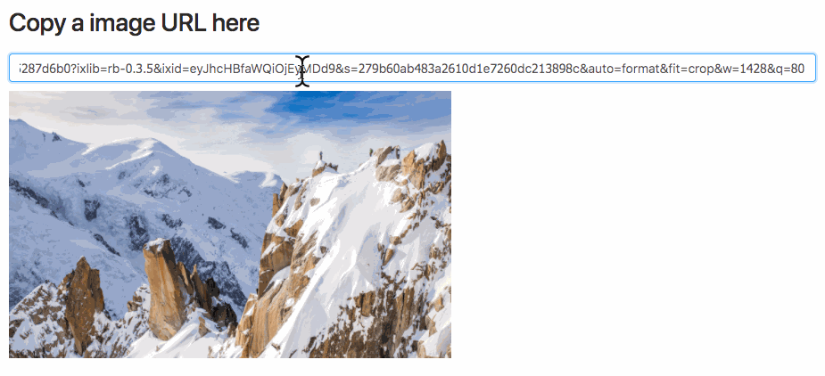

# react-loading-image [![NPM version][npm-image]][npm-url]  [![Dependency Status][daviddm-image]][daviddm-url]
> A react image loader component




## Installation

```sh
$ npm install --save react-loading-image
```

## Usage

```js
class Demo extends React.Component {
  constructor(props) {
    super(props);

    this.state = {
      value: null
    };
  }

  onChange = (e) => {
    this.setState({
      value: e.target.value
    });
  }

  render() {
    const {value} = this.state;
    return (
      <div>
        <h1>Copy a image URL here</h1>
        <input onChange={this.onChange}/>
        <p>
          value: {value}
        </p>
        <div>
          {value && (
            <ImageLoader
              src={value}
              loading={() => <div>Loading...</div>}
              error={() => <div>Error</div>}
              />
          )}
        </div>
      </div>
    );
  }
}
```

## Advanced

You might want to customized such as `<div/>` as your final view, instead of `` tags, you can use `image` prop to replace any React element as you wish!

For example, using `styled-components`:


```js
import styled from 'styled-components';

const PreviewImg = styled.div`
  background-image: url(${props => props.src});
  width: 100%;
  height: 300px;
  background-size: contain;
  background-repeat: no-repeat;
`;

class Demo extends React.Component {
  ...

  render() {
    const {value} = this.props;
    return (
      <div>
        <ImageLoader
          src={value}
          image={props => <PreviewImg {...props}/>} // change to your customized component
          loading={() => <div>Loading...</div>}
          error={() => <div>Error</div>}
          />
      </div>
    );
  }
}
```


## Props

| Name         | Type    | Default | Description |
| ------------ | ------- | ------- | ----------- |
| src | string | null | Image URL |
| onLoad | (img: Image) => void | null | This function will be called when image is loaded |
| onError | (err: Event) => void | null | This function will be called when image is failed |
| loading | () => React.Element<*> | null | Return a React element that will show when image is loading |
| error | () => React.Element<*> | null | Return a React element that will show when image is crashed |
| image | ({src: string, width: number, height: number}) => React.Element<*> | null | Final result will render to this customized React element, if you don't assign this props default image will render into `` |

## Start example server

```
npm start
```

## generate demo

```js
npm run gh-pages
```

## License

MIT © [chilijung](www.github.com/chilijung)


[npm-image]: https://badge.fury.io/js/react-loading-image.svg
[npm-url]: https://npmjs.org/package/react-loading-image
[travis-image]: https://travis-ci.org/Canner/react-loading-image.svg?branch=master
[travis-url]: https://travis-ci.org/Canner/react-loading-image
[daviddm-image]: https://david-dm.org/Canner/react-loading-image.svg?theme=shields.io
[daviddm-url]: https://david-dm.org/Canner/react-loading-image
